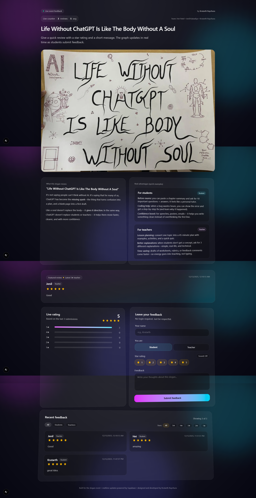

# Life Without ChatGPT — Reviews Website

Slogan event feedback website for:

**“Life Without ChatGPT Is Like The Body Without A Soul”**

Collects student/teacher reviews (name + role + rating + feedback) and shows a realtime rating graph + recent feedback.



## Features

- **No auth**: anyone can submit feedback.
- **Supabase DB**: stores reviews.
- **Realtime updates**: new reviews appear live.
- **GSAP animations** + 5★ confetti.
- **Filters**: All/Students/Teachers + star filter.
- **Featured review**: latest 5★ teacher review.
- **Toasts**: success/error messages (Sonner).
- **Sound toggle**: optional star click sound.

## Tech Stack

- Next.js (App Router)
- React
- Tailwind CSS
- Supabase
- GSAP
- Sonner (toasts)

## Setup

1) Install dependencies

```bash
npm install
```

2) Create `.env.local` (not committed)

```bash
NEXT_PUBLIC_SUPABASE_URL=YOUR_SUPABASE_URL
NEXT_PUBLIC_SUPABASE_ANON_KEY=YOUR_SUPABASE_ANON_KEY
```

3) Create the Supabase table + policies (SQL)

```sql
create table if not exists public.reviews (
  id uuid primary key default gen_random_uuid(),
  created_at timestamptz not null default now(),
  name text not null,
  role text not null check (role in ('student', 'teacher')),
  rating int not null check (rating >= 1 and rating <= 5),
  feedback text not null
);

create index if not exists reviews_created_at_idx on public.reviews (created_at desc);
create index if not exists reviews_rating_idx on public.reviews (rating);

alter table public.reviews enable row level security;

create policy "Public can read reviews"
on public.reviews
for select
to anon
using (true);

create policy "Public can insert reviews"
on public.reviews
for insert
to anon
with check (true);
```

4) Enable Supabase Realtime

- Supabase Dashboard → **Database** → **Replication / Realtime**
- Enable realtime for `public.reviews`

## Run

```bash
npm run dev
```

Open: http://localhost:3000

## Scripts

- `npm run dev`
- `npm run build`
- `npm run start`
- `npm run lint`

## Credits

- Team: **Het Patel**, **Jenil Kukadiya**, **Krutarth Raychura**
- Designed and developed by **Krutarth Raychura**
